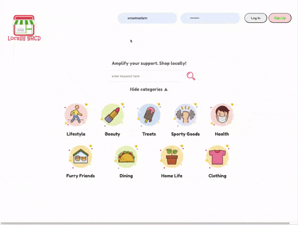

  
  
Small business listings and reviews.

<main style="margin-top:30px">
  <h1>About</h1>
  
LocallySRCD uses the user's latitude and longitude to recommend small businesses near them. Users may "favorite" stores and leave reviews.

  
This repo was forked from a product I worked on with a team. My contributions include:

  <ul>
    <li>modeled and implemented a non-relational database to store reviews</li>
    <li>expanded RESTful API to serve database requests</li> 
    <li>implemented reusable React form components for users to input new reviews</li>
  </ul>
</main>

<h1 style="margin-top:30px">Preview</h1>
